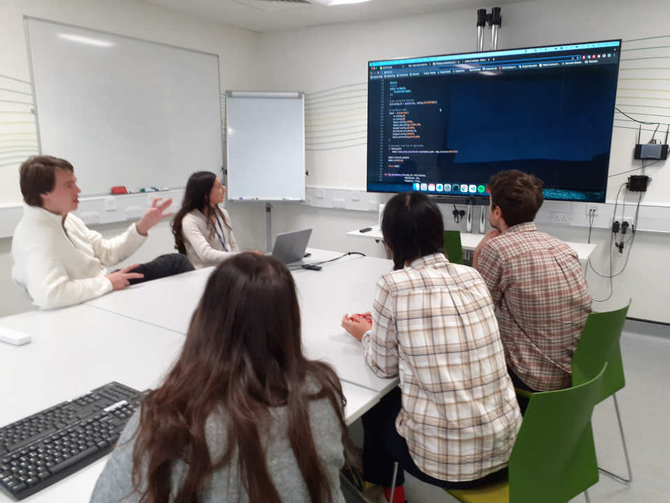
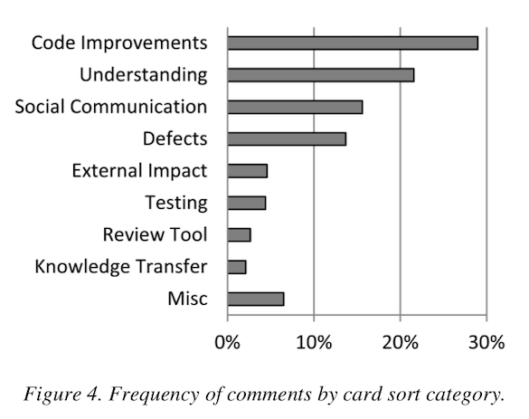

# Code review is great (yet nobody does it). {background-image="img/w19.jpg"}

Thibault Lestang

Department of Aeronautics, Imperial College London

{width=30%}

# The Oxford Code Review Network {background-image="img/w19.jpg"}

[https://github.com/OxfordCodeReviewNet/forum](https://github.com/OxfordCodeReviewNet/forum)

# What sets research software apart {background-image="img/w19.jpg"}

::: incremental

- Developed in a wide variety of contexts.
- Written to answer (a) specific question(s).
- Knowledge is the end-product, not software.
- Non-uniform software engineering experience.
- Mostly single developers.

:::

::: notes

Code by yourself, for your probmen
Code in a team, for use by other people

- only programmer working on your program.
- collaborate with more than 2 people.
- working on a software project that is meant to be used by others.

:::

# (Peer) Code review {background-image="img/w19.jpg"}

It's not your usual paper peer review process!

- Informal.
- Routine.
- Low-stakes.

# Changing scale {background-image="img/w19.jpg" transition=slide}

# In person {background-image="img/w19.jpg"}

Delimited time in the week

Avois written communication

# Short meetings {background-image="img/w19.jpg"}

It takes effort to

- Read source code.
- Understanding it.
- Forming an opinion about it.

More short meetings more effective than fewer longer ones.

# (Async) Preparation {background-image="img/w19.jpg"}

Reviewer extracts some code to review and provide **context** and
**expectations**.

Reviewers can spend up to 30min going through the code.

# It doesn't have to be perfect yet {background-image="img/w19.jpg"}

It is productive to look at code that is WIP.

The only expectation is that code is readable by reviewers.

# It's not about the bugs {background-image="img/w19.jpg"}

# Target: understandability {background-image="img/w19.jpg"}

Code review can be motivated by different aspects of software quality.

Defining a clear scope sets expectations and focuses feedback.

# Advice {background-image="img/w19.jpg"}

# Use a checklist {background-image="img/w19.jpg"}

-   [ ] Poor formatting.
-   [ ] Dead code.
-   [ ] Missing documentation.
-   [ ] Obscure names.
-   [ ] Complex conditionals.
-   [ ] Obscure one-liners.
-   [ ] Duplicated code.
-   [ ] Long procedures.
-   [ ] Long parameter lists.
-   [ ] Global state.
-   [ ] Abuse of primitive types.
-   [ ] Data clumps.
-   ...

::: notes

- "I don't know what to look for". Especially if low confidence.
- Start with items that do not require knowledge of the domain and/or
  the language.

:::

# Use a checklist... as a guide {background-image="img/w19.jpg"}

Some code can be crystal clear to language/domain experts and
perfectly obscure to beginners.

# Attitude {background-image="img/cycling_TT.jpg"}

# Communication is key {background-image="img/w19.jpg"}

Author: *This loop I wrote looks too complicated to me.*

. . .

Reviewer: *Hmmm yes. You could just use a pipe and `xargs`.*

. . .

Author: *What's `xargs`?*

. . .

Reviewer: *It's basically mapping a command over a set of inputs - think
functional programming!*

. . .

Author: *&#x2026;*

. . .

Reviewer: *Alhtough you could also do the same thing with `sed`.*

. . .

Author (looking frustrated): *I have no idea what you're talking about.*

# Giving feedback takes practice {background-image="img/w19.jpg"}

1.  Own you opinions.
2.  Make it about the code.
3.  Be specific.
4.  Suggest an alternative.

. . .

~~*Your function name doesn't make sense*~~

. . . 

*I think this function's purpose would be much clearer if it was given
a more explicit name.. perhaps `apply_bwd_transform`?*

# Code review is both **technical** and **social** {background-image="img/w19.jpg"}

Code reviews can drive both inclusion and exclusion.

. . .

> A bad reviewer tries to force their preference on you. A good code
> reviewer makes your code conform to certain principles, but not
> opinion. (*Quote from survey participant from Greiler, 2016*)

# Define (and refine) a policy {background-image="img/w19.jpg"}

-   Well defined process.
-   Default scope.
-   Moderator(s).
-   Code of conduct.
-   Conflict resolution.

::: notes

A code reviwe is a conversation, potentially involving more than 2 people. as
any converstaion it can shift to irrelevant topics, unproductive arguments or
power struggles.

A clear policy including moderation and conflict resolution procedures can
guard against these.

:::

# And yet... {background-image="img/w19.jpg" transition="slide"}

# And yet we stopped {background-image="img/w19.jpg"}

Bottom up doesn't go far without top-down.

Project managers must:

- Facilitate code review.
- Motivate it.
- Make it part of the team's culture.

# Software quality: a "nice to have" ? {background-image="img/w19.jpg"}

- Accelerates research.
- Drives inclusion.
- Attracts and retains talents.
- Magnifies impact.

# Software quality: a must have. {background-image="img/w19.jpg"}

Research software development should hold particularly high standards of quality.

- Auditability 
- Reproducibility
- Reuse, as-is or as a part of something else

